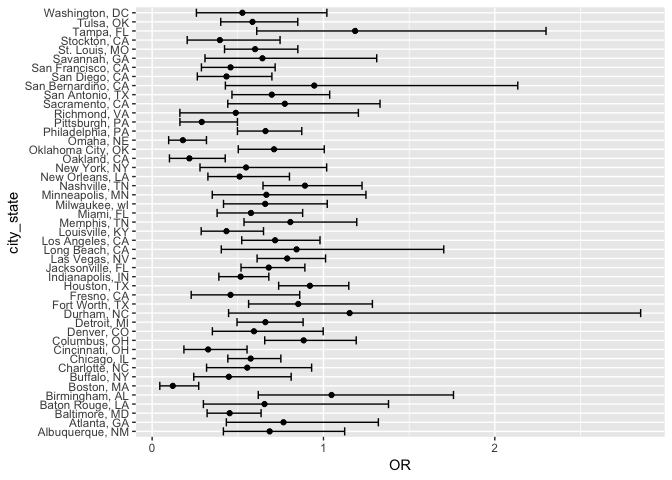
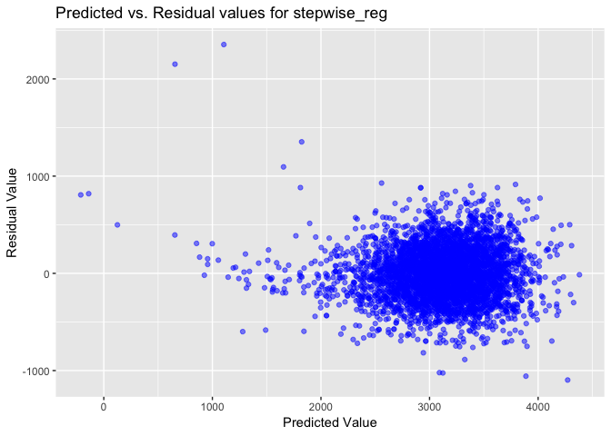

p8105\_hw6\_slb2240
================
Samantha Brown
11/19/2018

Problem 1
---------

The Washington Post has gathered data on homicides in 50 large U.S. cities and made the data available through a GitHub repository here.

*Create a city\_state variable (e.g. “Baltimore, MD”), and a binary variable indicating whether the homicide is solved. Omit cities Dallas, TX; Phoenix, AZ; and Kansas City, MO – these don’t report victim race. Also omit Tulsa, AL – this is a data entry mistake. Modifiy victim\_race to have categories white and non-white, with white as the reference category. Be sure that victim\_age is numeric.*

``` r
## Read in and wrangle data
homicide_data = read.csv("./homicide-data.csv") %>% 
  mutate(city_state = str_c(city, ", ", state)) %>% 
  filter(!(city_state %in% c("Tulsa, AL", "Dallas, TX", "Phoenix, AZ", "Kansas City, MO"))) %>% 
  mutate(homicide_solved = as.numeric(disposition == "Closed by arrest"),
         victim_race = ifelse(victim_race != "White", "nonwhite", "white"),
         victim_race = fct_relevel(victim_race, ref = "white"),
         victim_age = as.numeric(victim_age))
```

*For the city of Baltimore, MD, use the glm function to fit a logistic regression with resolved vs unresolved as the outcome and victim age, sex and race (as just defined) as predictors. Save the output of glm as an R object; apply the broom::tidy to this object; and obtain the estimate and confidence interval of the adjusted odds ratio for solving homicides comparing non-white victims to white victims keeping all other variables fixed.*

``` r
## Filter data to look at Baltimore, MD only
baltimore_data = homicide_data %>% 
  filter(city_state == "Baltimore, MD")

## Fit logistic regression
baltimore_glm = baltimore_data %>% 
  glm(homicide_solved ~ victim_age + victim_race + victim_sex, data = ., family = binomial())
  
## Clean up model and obtain odds ratio and CI for odds ratio
baltimore_glm %>% 
  broom::tidy(conf.int = TRUE) %>% 
  mutate(OR = exp(estimate),
         lower_bound = exp(conf.low),
         upper_bound = exp(conf.high)) %>% 
  select(term, OR, lower_bound, upper_bound) %>% 
  filter(term == "victim_racenonwhite") %>% 
  knitr::kable(digits = 3)
```

| term                 |     OR|  lower\_bound|  upper\_bound|
|:---------------------|------:|-------------:|-------------:|
| victim\_racenonwhite |  0.453|         0.321|         0.636|

I am 95% confident that the true odds ratio for homicides comparing non-white victims to white victims is between 0.321 and 0.63, keeping all other variables fixed.

*Now run glm for each of the cities in your dataset, and extract the adjusted odds ratio (and CI) for solving homicides comparing black victims to white victims. Do this within a “tidy” pipeline, making use of purrr::map, list columns, and unnest as necessary to create a dataframe with estimated ORs and CIs for each city.*

*Create a plot that shows the estimated ORs and CIs for each city. Organize cities according to estimated OR, and comment on the plot.*

``` r
## Extract adjusted odds ratio and confidence intervals for all cities in dataset
homicide_data %>% 
  group_by(city_state) %>% 
  nest() %>% 
  mutate(models = map(data, ~glm(homicide_solved ~ victim_age + victim_sex + victim_race, data = ., family = binomial())),
         CI_models = map(models, broom::confint_tidy)) %>% 
  mutate(models = map(models, broom::tidy)) %>% 
  select(-data) %>%
  unnest() %>% 
  filter(term == "victim_racenonwhite") %>% 
  mutate(OR = exp(estimate),
         lower_bound = exp(conf.low),
         upper_bound = exp(conf.high)) %>% 
  select(city_state, OR, lower_bound, upper_bound) %>% 
  ## Plot OR and confidence intervals
  ggplot(aes(x = reorder(city_state, OR), y = OR)) +
  geom_point() +
  geom_errorbar(aes(ymin = lower_bound, ymax = upper_bound)) +
  coord_flip() +
  labs(
    x = "City, State",
    y = "Odds Ratio and Confidence Interval",
    title = "Odds Ratio and Confidence Interval for Each City",
    caption = "Data source: https://github.com/washingtonpost/data-homicides"
  ) +
  theme(axis.text = element_text(size = 8, hjust = 1))
```



Finish commenting
-----------------

In the plot above, I calculated the odds ratio and confidence intervals for each city in the dataset. This odds ratio meausres the strength of the assiciation for homicides comparing nonwhite victims to white victims. The plot indicates Boston, MA had the lowest odds ratio, while Tampa, FL had the highest odds ratio.

Problem 2
---------

*Load and clean the data for regression analysis*

``` r
birthweight_data = read.csv("./birthweight.csv") %>% 
  janitor::clean_names() %>% 
  mutate(babysex = as.factor(ifelse(babysex == 1, "male", "female")),
         frace = as.factor(frace),
         frace = recode_factor(frace, "1" = "white", "2" = "black", "3" = "asian", "4" = "puerto rican", "8" = "other", "9" = "unknown"),
         malform = as.logical(malform),
         mrace = as.factor(mrace),
         mrace = recode_factor(mrace, "1" = "white", "2" = "black", "3" = "asian", "4" = "puerto rican", "8" = "other"))
```

*Propose a regression model for birthweight. This model may be based on a hypothesized structure for the factors that underly birthweight, on a data-driven model-building process, or a combination of the two. Describe your modeling process and show a plot of model residuals against fitted values – use add\_predictions and add\_residuals in making this plot.*

``` r
## First, fit a regression using all predictors
mult.fit = lm(bwt ~ ., data = birthweight_data)
summary(mult.fit)
```

    ## 
    ## Call:
    ## lm(formula = bwt ~ ., data = birthweight_data)
    ## 
    ## Residuals:
    ##      Min       1Q   Median       3Q      Max 
    ## -1097.68  -184.86    -3.33   173.09  2344.15 
    ## 
    ## Coefficients: (3 not defined because of singularities)
    ##                     Estimate Std. Error t value Pr(>|t|)    
    ## (Intercept)       -6236.6841   660.1884  -9.447  < 2e-16 ***
    ## babysexmale         -28.7073     8.4652  -3.391 0.000702 ***
    ## bhead               130.7781     3.4523  37.881  < 2e-16 ***
    ## blength              74.9536     2.0217  37.075  < 2e-16 ***
    ## delwt                 4.1007     0.3948  10.386  < 2e-16 ***
    ## fincome               0.2898     0.1795   1.614 0.106551    
    ## fraceblack           14.3313    46.1501   0.311 0.756168    
    ## fraceasian           21.2361    69.2960   0.306 0.759273    
    ## fracepuerto rican   -46.9962    44.6782  -1.052 0.292912    
    ## fraceother            4.2969    74.0741   0.058 0.953745    
    ## gaweeks              11.5494     1.4654   7.882 4.06e-15 ***
    ## malformTRUE           9.7650    70.6259   0.138 0.890039    
    ## menarche             -3.5508     2.8951  -1.226 0.220083    
    ## mheight               9.7874    10.3116   0.949 0.342588    
    ## momage                0.7593     1.2221   0.621 0.534418    
    ## mraceblack         -151.4354    46.0453  -3.289 0.001014 ** 
    ## mraceasian          -91.3866    71.9190  -1.271 0.203908    
    ## mracepuerto rican   -56.4787    45.1369  -1.251 0.210901    
    ## parity               95.5411    40.4793   2.360 0.018307 *  
    ## pnumlbw                   NA         NA      NA       NA    
    ## pnumsga                   NA         NA      NA       NA    
    ## ppbmi                 4.3538    14.8913   0.292 0.770017    
    ## ppwt                 -3.4716     2.6121  -1.329 0.183913    
    ## smoken               -4.8544     0.5871  -8.269  < 2e-16 ***
    ## wtgain                    NA         NA      NA       NA    
    ## ---
    ## Signif. codes:  0 '***' 0.001 '**' 0.01 '*' 0.05 '.' 0.1 ' ' 1
    ## 
    ## Residual standard error: 272.5 on 4320 degrees of freedom
    ## Multiple R-squared:  0.7183, Adjusted R-squared:  0.717 
    ## F-statistic: 524.6 on 21 and 4320 DF,  p-value: < 2.2e-16

``` r
## Stepwise elimination (from Methods I, lecture 18)
step(mult.fit, direction = "backward")
```

    ## Start:  AIC=48717.83
    ## bwt ~ babysex + bhead + blength + delwt + fincome + frace + gaweeks + 
    ##     malform + menarche + mheight + momage + mrace + parity + 
    ##     pnumlbw + pnumsga + ppbmi + ppwt + smoken + wtgain
    ## 
    ## 
    ## Step:  AIC=48717.83
    ## bwt ~ babysex + bhead + blength + delwt + fincome + frace + gaweeks + 
    ##     malform + menarche + mheight + momage + mrace + parity + 
    ##     pnumlbw + pnumsga + ppbmi + ppwt + smoken
    ## 
    ## 
    ## Step:  AIC=48717.83
    ## bwt ~ babysex + bhead + blength + delwt + fincome + frace + gaweeks + 
    ##     malform + menarche + mheight + momage + mrace + parity + 
    ##     pnumlbw + ppbmi + ppwt + smoken
    ## 
    ## 
    ## Step:  AIC=48717.83
    ## bwt ~ babysex + bhead + blength + delwt + fincome + frace + gaweeks + 
    ##     malform + menarche + mheight + momage + mrace + parity + 
    ##     ppbmi + ppwt + smoken
    ## 
    ##            Df Sum of Sq       RSS   AIC
    ## - frace     4    124365 320848704 48712
    ## - malform   1      1419 320725757 48716
    ## - ppbmi     1      6346 320730684 48716
    ## - momage    1     28661 320752999 48716
    ## - mheight   1     66886 320791224 48717
    ## - menarche  1    111679 320836018 48717
    ## - ppwt      1    131132 320855470 48718
    ## <none>                  320724338 48718
    ## - fincome   1    193454 320917792 48718
    ## - parity    1    413584 321137922 48721
    ## - mrace     3    868321 321592659 48724
    ## - babysex   1    853796 321578134 48727
    ## - gaweeks   1   4611823 325336161 48778
    ## - smoken    1   5076393 325800732 48784
    ## - delwt     1   8008891 328733230 48823
    ## - blength   1 102050296 422774634 49915
    ## - bhead     1 106535716 427260054 49961
    ## 
    ## Step:  AIC=48711.51
    ## bwt ~ babysex + bhead + blength + delwt + fincome + gaweeks + 
    ##     malform + menarche + mheight + momage + mrace + parity + 
    ##     ppbmi + ppwt + smoken
    ## 
    ##            Df Sum of Sq       RSS   AIC
    ## - malform   1      1447 320850151 48710
    ## - ppbmi     1      6975 320855679 48710
    ## - momage    1     28379 320877083 48710
    ## - mheight   1     69502 320918206 48710
    ## - menarche  1    115708 320964411 48711
    ## - ppwt      1    133961 320982665 48711
    ## <none>                  320848704 48712
    ## - fincome   1    194405 321043108 48712
    ## - parity    1    414687 321263390 48715
    ## - babysex   1    852133 321700837 48721
    ## - gaweeks   1   4625208 325473911 48772
    ## - smoken    1   5036389 325885093 48777
    ## - delwt     1   8013099 328861802 48817
    ## - mrace     3  13540415 334389119 48885
    ## - blength   1 101995688 422844392 49908
    ## - bhead     1 106662962 427511666 49956
    ## 
    ## Step:  AIC=48709.53
    ## bwt ~ babysex + bhead + blength + delwt + fincome + gaweeks + 
    ##     menarche + mheight + momage + mrace + parity + ppbmi + ppwt + 
    ##     smoken
    ## 
    ##            Df Sum of Sq       RSS   AIC
    ## - ppbmi     1      6928 320857079 48708
    ## - momage    1     28660 320878811 48708
    ## - mheight   1     69320 320919470 48708
    ## - menarche  1    116027 320966177 48709
    ## - ppwt      1    133894 320984044 48709
    ## <none>                  320850151 48710
    ## - fincome   1    193784 321043934 48710
    ## - parity    1    414482 321264633 48713
    ## - babysex   1    851279 321701430 48719
    ## - gaweeks   1   4624003 325474154 48770
    ## - smoken    1   5035195 325885346 48775
    ## - delwt     1   8029079 328879230 48815
    ## - mrace     3  13553320 334403471 48883
    ## - blength   1 102009225 422859375 49906
    ## - bhead     1 106675331 427525481 49954
    ## 
    ## Step:  AIC=48707.63
    ## bwt ~ babysex + bhead + blength + delwt + fincome + gaweeks + 
    ##     menarche + mheight + momage + mrace + parity + ppwt + smoken
    ## 
    ##            Df Sum of Sq       RSS   AIC
    ## - momage    1     29211 320886290 48706
    ## - menarche  1    117635 320974714 48707
    ## <none>                  320857079 48708
    ## - fincome   1    195199 321052278 48708
    ## - parity    1    412984 321270064 48711
    ## - babysex   1    850020 321707099 48717
    ## - mheight   1   1078673 321935752 48720
    ## - ppwt      1   2934023 323791103 48745
    ## - gaweeks   1   4621504 325478583 48768
    ## - smoken    1   5039368 325896447 48773
    ## - delwt     1   8024939 328882018 48813
    ## - mrace     3  13551444 334408523 48881
    ## - blength   1 102018559 422875638 49904
    ## - bhead     1 106821342 427678421 49953
    ## 
    ## Step:  AIC=48706.02
    ## bwt ~ babysex + bhead + blength + delwt + fincome + gaweeks + 
    ##     menarche + mheight + mrace + parity + ppwt + smoken
    ## 
    ##            Df Sum of Sq       RSS   AIC
    ## - menarche  1    100121 320986412 48705
    ## <none>                  320886290 48706
    ## - fincome   1    240800 321127090 48707
    ## - parity    1    431433 321317724 48710
    ## - babysex   1    841278 321727568 48715
    ## - mheight   1   1076739 321963029 48719
    ## - ppwt      1   2913653 323799943 48743
    ## - gaweeks   1   4676469 325562760 48767
    ## - smoken    1   5045104 325931394 48772
    ## - delwt     1   8000672 328886962 48811
    ## - mrace     3  14667730 335554021 48894
    ## - blength   1 101990556 422876847 49902
    ## - bhead     1 106864308 427750598 49952
    ## 
    ## Step:  AIC=48705.38
    ## bwt ~ babysex + bhead + blength + delwt + fincome + gaweeks + 
    ##     mheight + mrace + parity + ppwt + smoken
    ## 
    ##           Df Sum of Sq       RSS   AIC
    ## <none>                 320986412 48705
    ## - fincome  1    245637 321232048 48707
    ## - parity   1    422770 321409181 48709
    ## - babysex  1    846134 321832545 48715
    ## - mheight  1   1012240 321998651 48717
    ## - ppwt     1   2907049 323893461 48743
    ## - gaweeks  1   4662501 325648912 48766
    ## - smoken   1   5073849 326060260 48771
    ## - delwt    1   8137459 329123871 48812
    ## - mrace    3  14683609 335670021 48894
    ## - blength  1 102191779 423178191 49903
    ## - bhead    1 106779754 427766166 49950

    ## 
    ## Call:
    ## lm(formula = bwt ~ babysex + bhead + blength + delwt + fincome + 
    ##     gaweeks + mheight + mrace + parity + ppwt + smoken, data = birthweight_data)
    ## 
    ## Coefficients:
    ##       (Intercept)        babysexmale              bhead  
    ##         -6070.264            -28.558            130.777  
    ##           blength              delwt            fincome  
    ##            74.947              4.107              0.318  
    ##           gaweeks            mheight         mraceblack  
    ##            11.592              6.594           -138.792  
    ##        mraceasian  mracepuerto rican             parity  
    ##           -74.887           -100.678             96.305  
    ##              ppwt             smoken  
    ##            -2.676             -4.843

I performed a stepwise regression on the `birthweight_data`. I used the `step` function to develop several regression models by adding and eliminating different predictors one at a time, and ultimately identifying the best model. My model includes `babysex`, `bhead`, `blength`, `delwt`, `fincome`, `gaweeks`, `mheight`, `mrace`, `parity`, `ppwt`, and `smoken` as signficant predictors of the baby's weight. My model is summarized in the code chunk below:

``` r
stepwise_reg = lm(bwt ~ babysex + bhead + blength + delwt + fincome + gaweeks + mheight + mrace + parity + ppwt + smoken, data = birthweight_data)

## Tidied output of stepwise_reg
stepwise_reg %>%
  summary() %>% 
  broom::tidy() %>% 
  knitr::kable(digits = 4)
```

| term              |    estimate|  std.error|  statistic|  p.value|
|:------------------|-----------:|----------:|----------:|--------:|
| (Intercept)       |  -6070.2639|   136.9081|   -44.3382|   0.0000|
| babysexmale       |    -28.5580|     8.4549|    -3.3777|   0.0007|
| bhead             |    130.7770|     3.4466|    37.9441|   0.0000|
| blength           |     74.9471|     2.0190|    37.1200|   0.0000|
| delwt             |      4.1067|     0.3921|    10.4748|   0.0000|
| fincome           |      0.3180|     0.1747|     1.8199|   0.0688|
| gaweeks           |     11.5925|     1.4621|     7.9288|   0.0000|
| mheight           |      6.5940|     1.7849|     3.6944|   0.0002|
| mraceblack        |   -138.7925|     9.9071|   -14.0094|   0.0000|
| mraceasian        |    -74.8868|    42.3146|    -1.7698|   0.0768|
| mracepuerto rican |   -100.6781|    19.3247|    -5.2098|   0.0000|
| parity            |     96.3047|    40.3362|     2.3875|   0.0170|
| ppwt              |     -2.6756|     0.4274|    -6.2608|   0.0000|
| smoken            |     -4.8434|     0.5856|    -8.2712|   0.0000|

``` r
## Use modelr package for add_predictions() and add_residuals()
library(modelr)
```

    ## 
    ## Attaching package: 'modelr'

    ## The following object is masked from 'package:broom':
    ## 
    ##     bootstrap

``` r
## Calcluate predicted and residual values
predictors_and_residuals = birthweight_data %>% 
  add_predictions(stepwise_reg) %>% 
  add_residuals(stepwise_reg)

ggplot(predictors_and_residuals, aes(x = pred, y = resid)) +
  geom_point(alpha = .5, col = "blue") + 
  labs(
    x = "Predicted Value",
    y = "Residual Value",
    title = "Residuals vs. Predicted values for stepwise_reg"
  )
```



Compare your model to two others:

-   One using length at birth and gestational age as predictors (main effects only)
-   One using head circumference, length, sex, and all interactions (including the three-way interaction) between these

``` r
## Model using length at birth and gestational age as predictors (main effects only)
model_length_gaweeks = lm(bwt ~ blength + gaweeks, data = birthweight_data)
summary(model_length_gaweeks)
```

    ## 
    ## Call:
    ## lm(formula = bwt ~ blength + gaweeks, data = birthweight_data)
    ## 
    ## Residuals:
    ##     Min      1Q  Median      3Q     Max 
    ## -1709.6  -215.4   -11.4   208.2  4188.8 
    ## 
    ## Coefficients:
    ##              Estimate Std. Error t value Pr(>|t|)    
    ## (Intercept) -4347.667     97.958  -44.38   <2e-16 ***
    ## blength       128.556      1.990   64.60   <2e-16 ***
    ## gaweeks        27.047      1.718   15.74   <2e-16 ***
    ## ---
    ## Signif. codes:  0 '***' 0.001 '**' 0.01 '*' 0.05 '.' 0.1 ' ' 1
    ## 
    ## Residual standard error: 333.2 on 4339 degrees of freedom
    ## Multiple R-squared:  0.5769, Adjusted R-squared:  0.5767 
    ## F-statistic:  2958 on 2 and 4339 DF,  p-value: < 2.2e-16

``` r
## Model using head circumference, length, sex, and all interactions (including the three-way interaction) between these
model_interactions = lm(bwt ~ bhead + blength + babysex + bhead*blength + bhead*babysex + blength*babysex + bhead*blength*babysex, data = birthweight_data)
summary(model_interactions)
```

    ## 
    ## Call:
    ## lm(formula = bwt ~ bhead + blength + babysex + bhead * blength + 
    ##     bhead * babysex + blength * babysex + bhead * blength * babysex, 
    ##     data = birthweight_data)
    ## 
    ## Residuals:
    ##      Min       1Q   Median       3Q      Max 
    ## -1132.99  -190.42   -10.33   178.63  2617.96 
    ## 
    ## Coefficients:
    ##                             Estimate Std. Error t value Pr(>|t|)    
    ## (Intercept)                -801.9487  1102.3077  -0.728 0.466948    
    ## bhead                       -16.5975    34.0916  -0.487 0.626388    
    ## blength                     -21.6460    23.3720  -0.926 0.354421    
    ## babysexmale               -6374.8684  1677.7669  -3.800 0.000147 ***
    ## bhead:blength                 3.3244     0.7126   4.666 3.17e-06 ***
    ## bhead:babysexmale           198.3932    51.0917   3.883 0.000105 ***
    ## blength:babysexmale         123.7729    35.1185   3.524 0.000429 ***
    ## bhead:blength:babysexmale    -3.8781     1.0566  -3.670 0.000245 ***
    ## ---
    ## Signif. codes:  0 '***' 0.001 '**' 0.01 '*' 0.05 '.' 0.1 ' ' 1
    ## 
    ## Residual standard error: 287.7 on 4334 degrees of freedom
    ## Multiple R-squared:  0.6849, Adjusted R-squared:  0.6844 
    ## F-statistic:  1346 on 7 and 4334 DF,  p-value: < 2.2e-16

Make this comparison in terms of the cross-validated prediction error; use crossv\_mc and functions in purrr as appropriate
