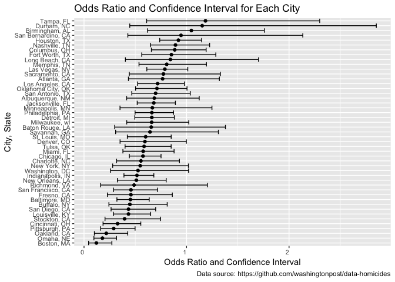

p8105\_hw6\_slb2240
================
Samantha Brown
11/19/2018

Problem 1
---------

The Washington Post has gathered data on homicides in 50 large U.S. cities and made the data available through a GitHub repository here.

*Create a city\_state variable (e.g. “Baltimore, MD”), and a binary variable indicating whether the homicide is solved. Omit cities Dallas, TX; Phoenix, AZ; and Kansas City, MO – these don’t report victim race. Also omit Tulsa, AL – this is a data entry mistake. Modifiy victim\_race to have categories white and non-white, with white as the reference category. Be sure that victim\_age is numeric.*

``` r
## Read in and wrangle data
homicide_data = read.csv("./homicide-data.csv") %>% 
  mutate(city_state = str_c(city, ", ", state)) %>% 
  filter(!(city_state %in% c("Tulsa, AL", "Dallas, TX", "Phoenix, AZ", "Kansas City, MO"))) %>% 
  mutate(homicide_solved = as.numeric(disposition == "Closed by arrest"),
         victim_race = ifelse(victim_race != "White", "nonwhite", "white"),
         victim_race = fct_relevel(victim_race, ref = "white"),
         victim_age = as.numeric(victim_age))
```

*For the city of Baltimore, MD, use the glm function to fit a logistic regression with resolved vs unresolved as the outcome and victim age, sex and race (as just defined) as predictors. Save the output of glm as an R object; apply the broom::tidy to this object; and obtain the estimate and confidence interval of the adjusted odds ratio for solving homicides comparing non-white victims to white victims keeping all other variables fixed.*

``` r
## Filter data to look at Baltimore, MD only
baltimore_data = homicide_data %>% 
  filter(city_state == "Baltimore, MD")

## Fit logistic regression
baltimore_glm = baltimore_data %>% 
  glm(homicide_solved ~ victim_age + victim_race + victim_sex, data = ., family = binomial())
  
## Clean up model and obtain odds ratio and CI for odds ratio
baltimore_glm %>% 
  broom::tidy(conf.int = TRUE) %>% 
  mutate(OR = exp(estimate),
         lower_bound = exp(conf.low),
         upper_bound = exp(conf.high)) %>% 
  select(term, OR, lower_bound, upper_bound) %>% 
  filter(term == "victim_racenonwhite") %>% 
  knitr::kable(digits = 3)
```

| term                 |     OR|  lower\_bound|  upper\_bound|
|:---------------------|------:|-------------:|-------------:|
| victim\_racenonwhite |  0.453|         0.321|         0.636|

I am 95% confident that the true odds ratio for homicides comparing non-white victims to white victims is between 0.321 and 0.63, keeping all other variables fixed.

*Now run glm for each of the cities in your dataset, and extract the adjusted odds ratio (and CI) for solving homicides comparing black victims to white victims. Do this within a “tidy” pipeline, making use of purrr::map, list columns, and unnest as necessary to create a dataframe with estimated ORs and CIs for each city.*

*Create a plot that shows the estimated ORs and CIs for each city. Organize cities according to estimated OR, and comment on the plot.*

``` r
## Extract adjusted odds ratio and confidence intervals for all cities in dataset
homicide_data %>% 
  group_by(city_state) %>% 
  nest() %>% 
  mutate(models = map(data, ~glm(homicide_solved ~ victim_age + victim_sex + victim_race, data = ., family = binomial())),
         CI_models = map(models, broom::confint_tidy)) %>% 
  mutate(models = map(models, broom::tidy)) %>% 
  select(-data) %>%
  unnest() %>% 
  filter(term == "victim_racenonwhite") %>% 
  mutate(OR = exp(estimate),
         lower_bound = exp(conf.low),
         upper_bound = exp(conf.high)) %>% 
  select(city_state, OR, lower_bound, upper_bound) %>% 
  ## Plot OR and confidence intervals
  ggplot(aes(x = reorder(city_state, OR), y = OR)) +
  geom_point() +
  geom_errorbar(aes(ymin = lower_bound, ymax = upper_bound)) +
  coord_flip() +
  labs(
    x = "City, State",
    y = "Odds Ratio and Confidence Interval",
    title = "Odds Ratio and Confidence Interval for Each City",
    caption = "Data source: https://github.com/washingtonpost/data-homicides"
  ) +
  theme(axis.text = element_text(size = 8, hjust = 1))
```



Finish commenting
-----------------

In the plot above, I calculated the odds ratio and confidence intervals for each city in the dataset. This odds ratio meausres the strength of the assiciation for homicides comparing nonwhite victims to white victims. The plot indicates Boston, MA had the lowest odds ratio, while Tampa, FL had the highest odds ratio.

Problem 2
---------

*Load and clean the data for regression analysis*

``` r
birthweight_data = read.csv("./birthweight.csv") %>% 
  janitor::clean_names() %>% 
  mutate(babysex = as.factor(ifelse(babysex == 1, "male", "female")),
         frace = as.factor(frace),
         frace = recode_factor(frace, "1" = "white", "2" = "black", "3" = "asian", "4" = "puerto rican", "8" = "other", "9" = "unknown"),
         malform = as.logical(malform),
         mrace = as.factor(mrace),
         mrace = recode_factor(mrace, "1" = "white", "2" = "black", "3" = "asian", "4" = "puerto rican", "8" = "other"))
```

*Propose a regression model for birthweight. This model may be based on a hypothesized structure for the factors that underly birthweight, on a data-driven model-building process, or a combination of the two. Describe your modeling process and show a plot of model residuals against fitted values – use add\_predictions and add\_residuals in making this plot.*

I performed a stepwise regression on the `birthweight_data`. I used the `step` function to develop several regression models by adding and eliminating different predictors one at a time, and ultimately identifying the best model. My model includes `babysex`, `bhead`, `blength`, `delwt`, `fincome`, `gaweeks`, `mheight`, `mrace`, `parity`, `ppwt`, and `smoken` as signficant predictors of the baby's weight. My model is summarized in the code chunk below:

``` r
stepwise_reg = lm(bwt ~ babysex + bhead + blength + delwt + fincome + gaweeks + mheight + mrace + parity + ppwt + smoken, data = birthweight_data)

## Tidied output of stepwise_reg
stepwise_reg %>%
  summary() %>% 
  broom::tidy() %>% 
  knitr::kable(digits = 4)
```

| term              |    estimate|  std.error|  statistic|  p.value|
|:------------------|-----------:|----------:|----------:|--------:|
| (Intercept)       |  -6070.2639|   136.9081|   -44.3382|   0.0000|
| babysexmale       |    -28.5580|     8.4549|    -3.3777|   0.0007|
| bhead             |    130.7770|     3.4466|    37.9441|   0.0000|
| blength           |     74.9471|     2.0190|    37.1200|   0.0000|
| delwt             |      4.1067|     0.3921|    10.4748|   0.0000|
| fincome           |      0.3180|     0.1747|     1.8199|   0.0688|
| gaweeks           |     11.5925|     1.4621|     7.9288|   0.0000|
| mheight           |      6.5940|     1.7849|     3.6944|   0.0002|
| mraceblack        |   -138.7925|     9.9071|   -14.0094|   0.0000|
| mraceasian        |    -74.8868|    42.3146|    -1.7698|   0.0768|
| mracepuerto rican |   -100.6781|    19.3247|    -5.2098|   0.0000|
| parity            |     96.3047|    40.3362|     2.3875|   0.0170|
| ppwt              |     -2.6756|     0.4274|    -6.2608|   0.0000|
| smoken            |     -4.8434|     0.5856|    -8.2712|   0.0000|

``` r
## Use modelr package for add_predictions() and add_residuals()
library(modelr)
```

    ## 
    ## Attaching package: 'modelr'

    ## The following object is masked from 'package:broom':
    ## 
    ##     bootstrap

``` r
## Calcluate predicted and residual values
predictors_and_residuals = birthweight_data %>% 
  add_predictions(stepwise_reg) %>% 
  add_residuals(stepwise_reg)

ggplot(predictors_and_residuals, aes(x = pred, y = resid)) +
  geom_point(alpha = .5, col = "blue") + 
  labs(
    x = "Predicted Value",
    y = "Residual Value",
    title = "Residuals vs. Predicted values for stepwise_reg"
  )
```


Compare your model to two others:

-   One using length at birth and gestational age as predictors (main effects only)
-   One using head circumference, length, sex, and all interactions (including the three-way interaction) between these

``` r
## Model using length at birth and gestational age as predictors (main effects only)
model_length_gaweeks = lm(bwt ~ blength + gaweeks, data = birthweight_data)
summary(model_length_gaweeks)
```

    ## 
    ## Call:
    ## lm(formula = bwt ~ blength + gaweeks, data = birthweight_data)
    ## 
    ## Residuals:
    ##     Min      1Q  Median      3Q     Max 
    ## -1709.6  -215.4   -11.4   208.2  4188.8 
    ## 
    ## Coefficients:
    ##              Estimate Std. Error t value Pr(>|t|)    
    ## (Intercept) -4347.667     97.958  -44.38   <2e-16 ***
    ## blength       128.556      1.990   64.60   <2e-16 ***
    ## gaweeks        27.047      1.718   15.74   <2e-16 ***
    ## ---
    ## Signif. codes:  0 '***' 0.001 '**' 0.01 '*' 0.05 '.' 0.1 ' ' 1
    ## 
    ## Residual standard error: 333.2 on 4339 degrees of freedom
    ## Multiple R-squared:  0.5769, Adjusted R-squared:  0.5767 
    ## F-statistic:  2958 on 2 and 4339 DF,  p-value: < 2.2e-16

``` r
## Model using head circumference, length, sex, and all interactions (including the three-way interaction) between these
model_interactions = lm(bwt ~ bhead + blength + babysex + bhead*blength + bhead*babysex + blength*babysex + bhead*blength*babysex, data = birthweight_data)
summary(model_interactions)
```

    ## 
    ## Call:
    ## lm(formula = bwt ~ bhead + blength + babysex + bhead * blength + 
    ##     bhead * babysex + blength * babysex + bhead * blength * babysex, 
    ##     data = birthweight_data)
    ## 
    ## Residuals:
    ##      Min       1Q   Median       3Q      Max 
    ## -1132.99  -190.42   -10.33   178.63  2617.96 
    ## 
    ## Coefficients:
    ##                             Estimate Std. Error t value Pr(>|t|)    
    ## (Intercept)                -801.9487  1102.3077  -0.728 0.466948    
    ## bhead                       -16.5975    34.0916  -0.487 0.626388    
    ## blength                     -21.6460    23.3720  -0.926 0.354421    
    ## babysexmale               -6374.8684  1677.7669  -3.800 0.000147 ***
    ## bhead:blength                 3.3244     0.7126   4.666 3.17e-06 ***
    ## bhead:babysexmale           198.3932    51.0917   3.883 0.000105 ***
    ## blength:babysexmale         123.7729    35.1185   3.524 0.000429 ***
    ## bhead:blength:babysexmale    -3.8781     1.0566  -3.670 0.000245 ***
    ## ---
    ## Signif. codes:  0 '***' 0.001 '**' 0.01 '*' 0.05 '.' 0.1 ' ' 1
    ## 
    ## Residual standard error: 287.7 on 4334 degrees of freedom
    ## Multiple R-squared:  0.6849, Adjusted R-squared:  0.6844 
    ## F-statistic:  1346 on 7 and 4334 DF,  p-value: < 2.2e-16

*Make this comparison in terms of the cross-validated prediction error; use crossv\_mc and functions in purrr as appropriate*

``` r
cv_df = 
  crossv_mc(birthweight_data, 1000) %>% 
  ## Create training and testing groups
  mutate(train = map(train, as_tibble), 
         test = map(test, as_tibble)) %>% 
  ## Apply training groups for the three models
  mutate(stepwise = map(train, ~lm(bwt ~ babysex + bhead + blength + delwt + fincome + gaweeks + mheight + mrace + parity + ppwt + smoken, data = birthweight_data)),
         length_gaweeks = map(train, ~lm(bwt ~ blength + gaweeks, data = birthweight_data)),
         interactions = map(train, ~lm(bwt ~ bhead + blength + babysex + bhead*blength + bhead*babysex + blength*babysex + bhead*blength*babysex, data = birthweight_data))) %>% 
  ## Map testing data
  mutate(rmse_stepwise_reg = map2_dbl(stepwise, test, ~rmse(model = .x, data = .y)),
         rmse_model_length_gaweeks = map2_dbl(length_gaweeks, test, ~rmse(model = .x, data = .y)),
         rmse_model_interactions = map2_dbl(interactions, test, ~rmse(model = .x, data = .y)))


## Create plot
cv_df %>% 
  select(starts_with("rmse")) %>% 
  gather(key = model, value = rmse) %>% 
  mutate(model = str_replace(model, "rmse_", ""),
         model = fct_inorder(model)) %>% 
  ggplot(aes(x = model, y = rmse)) + 
  geom_violin()
```


